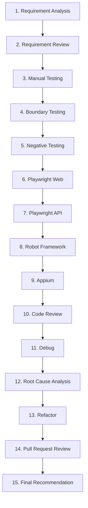

# AI QA Pilot — Enterprise AI Coding Assistant Evaluation


## Executive Overview
This repository is an **Enterprise AI Pilot Project** designed to evaluate AI Coding Assistants such as **GitHub Copilot**, **Amazon Q Developer**, and **Kiro**. The evaluation is conducted through realistic QA engineering workflows rather than isolated, simple prompts. 

**Note:** This repository is NOT intended to benchmark Playwright or any other automation tool itself. The purpose is strictly to evaluate the capabilities of AI assistants in a real-world enterprise QA automation context.

## Why this benchmark?
AI assistants are often evaluated in isolation with toy prompts or simple leetcode problems. This fails to measure their true utility in a real engineering environment where context, complex requirements, and multi-step workflows are the norm. This benchmark solves that problem by simulating a complete, end-to-end working day of a QA Automation Engineer.

## How it works
The evaluation follows a comprehensive 15-step workflow that builds upon itself. Each step depends on the outputs from the previous steps, testing the AI's ability to maintain context and follow a complex engineering lifecycle.

1. Requirement Analysis
2. Requirement Review
3. Manual Testing
4. Boundary Testing
5. Negative Testing
6. Playwright Web Automation
7. Playwright API Automation
8. Robot Framework Mobile Automation
9. Appium Mobile Automation
10. Code Review
11. Debug Failed Tests
12. Root Cause Analysis
13. Refactor Existing Automation
14. Pull Request Review
15. Final Recommendation

## Repository Structure
```
ai-qa-pilot/
├── README.md               # This file
├── docs/                   # Pilot guides, environment setup, and tool profiles
├── requirements/           # Simulated enterprise business documents (BRD, User Stories, etc.)
├── prompts/                # The 15 evaluation prompts to feed to the AI assistants
├── benchmark/              # Test scenarios, expected outputs, and observation logs
├── sample-project/         # Project skeletons for Web, API, and Mobile automation
└── report/                 # Final evaluation report templates
```

## Technology Stack
The benchmark focuses on modern enterprise automation technologies:
* **Web Automation**: Playwright + TypeScript (Page Object Model, Fixtures, Parallel Execution)
* **API Automation**: Playwright API Testing (APIRequestContext, CRUD, Schema Validation)
* **Mobile Automation**: Robot Framework + Appium (Android & iOS)

## Test Applications
We use realistic applications to simulate enterprise environments:
* **Web**: [SauceDemo](https://www.saucedemo.com) (Treated as an enterprise e-commerce system)
* **API**: [Restful Booker](https://restful-booker.herokuapp.com/apidoc/index.html)
* **Mobile**: [Sauce Labs My Demo App](https://github.com/saucelabs/my-demo-app-rn)

## Quick Start
### Prerequisites
* Node.js 20+
* Python 3.11+
* Java 17+ (for Appium)

### Setup Steps
1. Clone this repository.
2. Review the `docs/Pilot-Guide.md` for evaluation instructions.
3. Follow `docs/Environment.md` to set up your local environment.
4. Begin the evaluation using the prompts in the `prompts/` directory in sequential order.

## Navigation
| Document | Description |
|----------|-------------|
| [Pilot Guide](docs/Pilot-Guide.md) | How to run the evaluation |
| [Environment Setup](docs/Environment.md) | Local environment configuration |
| [How to Test](docs/How-to-Test.md) | Executing the test suites |
| [AI Methodology](docs/AI-Evaluation-Methodology.md) | Scoring rubric and dimensions |
| [Observation Log](benchmark/Observation-Log.md) | Log your findings |
| [Final Report](report/Final-Report.md) | Template for final evaluation results |

## Workflow Diagram


## Contributing
Contributions to improve the benchmark, add new test scenarios, or support additional AI assistants are welcome. Please submit a pull request with detailed descriptions of your changes.

## License
MIT License
