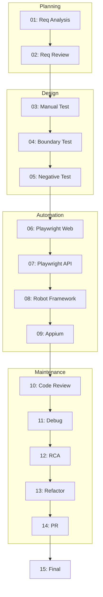

# Benchmark Test Scenarios

**Cross-References**: [Prompts Directory](../prompts/) | [Evaluation Methodology](../docs/AI-Evaluation-Methodology.md)

## Overview
This document outlines the evaluation scenarios for each phase of the AI pilot.

## Phase 01: Requirement Analysis
* **Scenario**: AI processes raw business requirements.
* **Input**: BRD.md, User-Stories.md
* **Expected Behavior**: Outputs a structured RTM and identifies missing logic.
* **Acceptance**: RTM maps all 20 stories. Identifies `locked_out_user` as a boundary.

## Phase 02: Requirement Review
* **Scenario**: AI acts as QA Lead signing off on requirements.
* **Input**: Phase 01 output, Acceptance-Criteria.md
* **Expected Behavior**: Identifies gaps in acceptance criteria.
* **Acceptance**: Flags tax calculation as needing an edge case. Formal sign-off provided.

## Phase 03: Manual Test Design
* **Scenario**: AI translates stories to test cases.
* **Input**: User-Stories.md, Acceptance-Criteria.md
* **Expected Behavior**: Outputs structured manual tests.
* **Acceptance**: Generates 40+ tests using Gherkin `Given` format.

## Phase 04: Boundary Value Analysis
* **Scenario**: AI performs BVA on forms.
* **Input**: Phase 03 output, Business-Rules.md
* **Expected Behavior**: Outputs BVA matrix for inputs.
* **Acceptance**: Correctly analyzes First Name, Last Name, Zip, limits (empty string).

## Phase 05: Negative Testing
* **Scenario**: AI designs tests for failure modes.
* **Input**: Phase 04 output, Business-Rules.md
* **Expected Behavior**: Outputs negative test cases.
* **Acceptance**: Includes OWASP risks (XSS/SQLi) and categorizes by Risk Level.

## Phase 06: Playwright Web Automation
* **Scenario**: AI generates Playwright POM framework.
* **Input**: Phase 05 output, Requirements docs.
* **Expected Behavior**: Outputs TypeScript Playwright code.
* **Acceptance**: 7 POM classes, 25+ tests, `playwright.config.ts`, parallel execution configured.

## Phase 07: Playwright API Automation
* **Scenario**: AI generates API tests for Restful Booker.
* **Input**: API Docs, sample-project/playwright-api/
* **Expected Behavior**: Outputs APIRequestContext code.
* **Acceptance**: Auth flow, CRUD covered, Schema validation included, NO Axios.

## Phase 08: Robot Framework Automation
* **Scenario**: AI generates Mobile test structure.
* **Input**: Mobile App details, Environment.md
* **Expected Behavior**: Outputs `.robot` and `.resource` files.
* **Acceptance**: 15+ tests, uses AppiumLibrary, supports Android/iOS variables.

## Phase 09: Appium Mobile Automation
* **Scenario**: AI provides Appium capability specifics.
* **Input**: Phase 08 output.
* **Expected Behavior**: Outputs desired capabilities and locator strategy.
* **Acceptance**: Explains `accessibility_id` priority for React Native.

## Phase 10: Code Review
* **Scenario**: AI reviews its own generated code.
* **Input**: Phases 06-09 code.
* **Expected Behavior**: Finds flaws or improvements.
* **Acceptance**: 15+ findings categorized by severity.

## Phase 11: Debugging
* **Scenario**: AI fixes broken code.
* **Input**: Prompt 11 broken snippets.
* **Expected Behavior**: Identifies root cause and provides fixed code.
* **Acceptance**: All 5 bugs correctly fixed with error message explanation.

## Phase 12: Root Cause Analysis
* **Scenario**: AI investigates simulated failures.
* **Input**: Prompt 12 failure list.
* **Expected Behavior**: Performs RCA.
* **Acceptance**: Uses 5-Whys for at least 2 scenarios.

## Phase 13: Refactoring
* **Scenario**: AI improves code maintainability.
* **Input**: Phase 06-09 code, Phase 10 review.
* **Expected Behavior**: Outputs refactored code.
* **Acceptance**: Extracts locators, adds fixtures, shows 3 file diffs.

## Phase 14: Pull Request
* **Scenario**: AI drafts a PR for the refactor.
* **Input**: Phase 13 output.
* **Expected Behavior**: Outputs PR template and review comments.
* **Acceptance**: Professional description, 5+ inline review comments.

## Phase 15: Final Comparison
* **Scenario**: AI self-assesses.
* **Input**: All phases.
* **Expected Behavior**: Outputs synthesis report.
* **Acceptance**: Honest assessment, distinguishes Copilot vs Autopilot.
