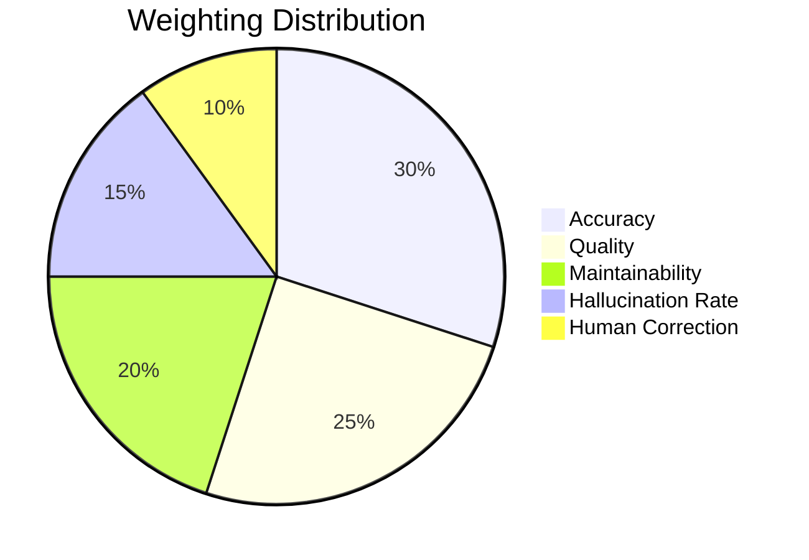

# AI Evaluation Methodology

## Introduction
Evaluating AI coding assistants requires a structured, objective framework to avoid subjective bias. This methodology defines how to score AI outputs fairly across different tools using a standardized rubric.

## Evaluation Dimensions & Scoring Rubric
Scores are awarded on a scale of 1 to 5.

### 1. Requirement Analysis Quality
* **5**: Perfect understanding, identifies implicit edge cases, asks clarifying questions.
* **3**: Basic understanding, maps explicit requirements, misses nuances.
* **1**: Misinterprets requirements, hallucinated features.

### 2. Code Quality
* **5**: Enterprise-grade (clean, DRY, adheres to POM, excellent naming conventions, typed).
* **3**: Functional but messy (some hardcoding, inconsistent naming).
* **1**: Uncompilable, spaghetti code, ignores requested design patterns.

### 3. Accuracy
* **5**: Output exactly matches the prompt instructions and constraints.
* **3**: Meets most instructions but misses minor constraints (e.g., used wrong assertion type).
* **1**: Completely failed to perform the requested task.

### 4. Maintainability
* **5**: Highly modular, reusable fixtures, data-driven.
* **3**: Somewhat modular, but requires effort to scale.
* **1**: Hardcoded values everywhere, huge monolithic files.

### 5. Human Correction Effort
* **5**: Zero corrections needed; ready to merge. (Score = 5)
* **4**: Minor tweaks (e.g., fixing a typo in a selector).
* **3**: Moderate rework required (fixing async logic).
* **2**: Major rework (rewriting a whole POM class).
* **1**: Complete rewrite required. (Score = 1)

### Hallucination Rate
Count the number of instances where the AI invents APIs, uses non-existent UI selectors, or references libraries not in the stack.

## Scoring Methodology
Each phase receives a weighted score:
* Quality: 25%
* Accuracy: 30%
* Maintainability: 20%
* Human Correction (5 - effort level): 10%
* Hallucinations (5 - count, min 0): 15%

`Weighted Score = (Quality * 0.25) + (Accuracy * 0.30) + (Maintainability * 0.20) + (CorrectionScore * 0.10) + (HallucinationScore * 0.15)`

## Fair Testing Rules
1. **Consistency**: Use the exact same prompts, in the same order, for every tool.
2. **Environment**: Use the same IDE and project structure.
3. **No Coaching**: Do not prompt the AI to fix its mistakes unless the workflow specifically calls for it (e.g., Phase 11 Debugging). Record the initial failure.

## Qualitative Observations
Beyond scores, observe:
* How well does the AI remember context from Phase 01 when generating code in Phase 06?
* Does it proactively suggest best practices?
* Is the response generation fast or slow?

## Enterprise Readiness
* **4.5 - 5.0**: Ready - Can be deployed as a primary tool with minimal oversight.
* **3.5 - 4.4**: Conditionally Ready - Useful as a copilot, requires human review.
* **< 3.5**: Not Ready - Causes more work than it saves.

## Scoring Matrix

## Cross-References
* [Result Template](Result-Template.md)
* [Observation Log](../benchmark/Observation-Log.md)
* [AI Comparison Notes](../benchmark/AI-Comparison-Notes.md)
