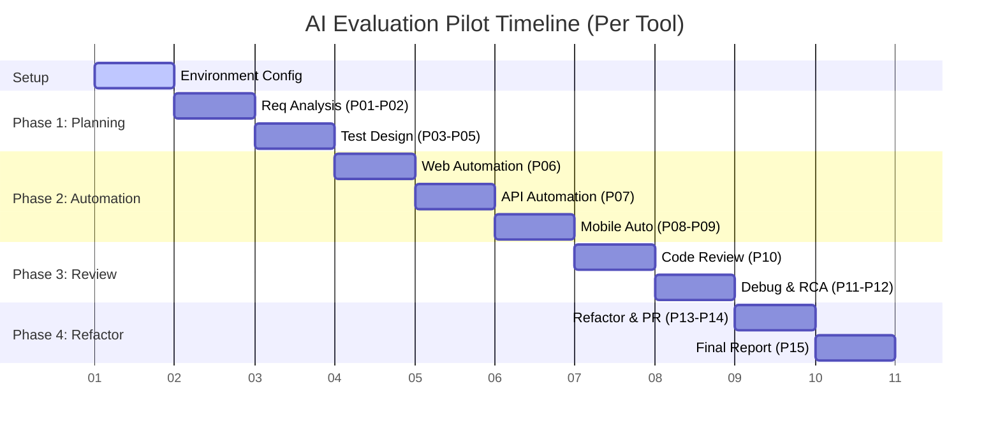

# Pilot Guide

## Purpose and Scope
This guide outlines how to conduct the Enterprise AI Pilot Project. The goal is to objectively evaluate AI coding assistants (GitHub Copilot, Amazon Q Developer, Kiro, etc.) by simulating a real-world QA Automation Engineer's workflow. 

## Who Should Use This Guide
* QA Automation Leads
* Engineering Managers
* Tool Evaluation and Procurement Teams
* Software Architects

## Evaluation Philosophy
We do not evaluate AI assistants using isolated, single-turn prompts (e.g., "Write a login test"). Real engineering requires context, understanding complex business requirements, and iterative development. This pilot forces the AI through a continuous, dependent workflow to test memory, reasoning, and context retention.

## The 15-Step Workflow
1. **Requirement Analysis** (Est. 20 min): AI analyzes a BRD and outputs a Requirements Traceability Matrix (RTM). *Criteria: Completeness, identification of gaps.*
2. **Requirement Review** (Est. 15 min): AI performs a formal review of the RTM. *Criteria: Finding missing edge cases.*
3. **Manual Testing** (Est. 30 min): AI designs manual test cases based on user stories. *Criteria: Coverage, Gherkin syntax.*
4. **Boundary Testing** (Est. 15 min): AI performs Boundary Value Analysis (BVA). *Criteria: Correct boundary identification.*
5. **Negative Testing** (Est. 20 min): AI designs negative test cases. *Criteria: Risk identification, security awareness.*
6. **Playwright Web Automation** (Est. 60 min): AI generates a POM-based Playwright framework. *Criteria: TypeScript quality, POM adherence, robust selectors.*
7. **Playwright API Automation** (Est. 45 min): AI generates API tests. *Criteria: Auth handling, CRUD logic, schema validation.*
8. **Robot Framework Mobile Automation** (Est. 45 min): AI generates mobile tests. *Criteria: Appium library usage, resource organization.*
9. **Appium Mobile Automation** (Est. 30 min): AI generates Appium specific configurations. *Criteria: React Native locator strategies.*
10. **Code Review** (Est. 20 min): AI reviews previously generated code. *Criteria: Finding real issues, severity categorization.*
11. **Debug Failed Tests** (Est. 25 min): AI debugs broken code snippets. *Criteria: Accurate root cause identification, correct fixes.*
12. **Root Cause Analysis** (Est. 30 min): AI performs RCA on simulated failures. *Criteria: 5-Whys usage, defect classification.*
13. **Refactor Existing Automation** (Est. 40 min): AI refactors code for better maintainability. *Criteria: DRY principles, fixture usage.*
14. **Pull Request Review** (Est. 20 min): AI creates and reviews a PR. *Criteria: PR formatting, inline comments.*
15. **Final Recommendation** (Est. 15 min): AI synthesizes its performance. *Criteria: Honesty, structured synthesis.*

## How to Use the Prompts
The `prompts/` directory contains 15 markdown files. Execute them in order. 
1. Open the AI assistant's chat interface.
2. Provide the context files mentioned in the prompt (e.g., open `BRD.md` in your editor or attach it).
3. Paste the contents of the prompt file into the chat.
4. Evaluate the response.

## Recording Observations
Record all findings in the [Observation Log](../benchmark/Observation-Log.md). You must create a new copy of this log for each AI assistant evaluated.

## Final Report
After evaluating all tools, compile the results into the [Final Report](../report/Final-Report.md).

## Pilot Timeline

## Do's and Don'ts
* **DO** use the exact same prompts for every AI assistant.
* **DO** evaluate them in the same environment.
* **DO** restart the context/session at logical breaks if the AI's context window fills up, but note when this happens.
* **DON'T** coach the AI (e.g., "No, you forgot the password field, try again"). Record the failure and move on.
* **DON'T** skip phases.

## Cross-References
* [Environment Setup](Environment.md)
* [How to Test](How-to-Test.md)
* [AI Evaluation Methodology](AI-Evaluation-Methodology.md)
