# AI Coding Assistant Evaluation — Final Report

**Version**: 1.0  
**Date**: [YYYY-MM-DD]  
**Author**: Enterprise QA Architect  
**Classification**: Internal  

## Table of Contents
1. Executive Summary
2. Evaluation Environment
3. Evaluation Methodology
4. Phase Results (01-15)
5. Aggregated Scores
6. Detailed Findings (Phases 01-14)
7. Enterprise Readiness Assessment
8. Strengths and Weaknesses
9. Final Recommendation

---

## 1. Executive Summary
This report details the findings of the Enterprise AI Pilot Project, comparing GitHub Copilot, Amazon Q Developer, and Kiro. The evaluation subjected the tools to a 15-step QA engineering workflow.

**Winner**: [Winning Tool Name]  
**Go/No-Go Recommendation**: [GO / NO-GO for enterprise procurement]

## 2. Evaluation Environment
* **OS**: [OS details]
* **IDE**: VS Code / AWS Kiro
* **Test Apps**: SauceDemo (Web), Restful Booker (API), My Demo App (Mobile)
* **Frameworks**: Playwright 1.44+, Robot Framework 7.x, Appium 2.x

## 3. Evaluation Methodology
Refer to the [AI Evaluation Methodology](../docs/AI-Evaluation-Methodology.md) for the scoring rubric (1-5 scale).

## 4. Phase Results Summary
| Phase | Winner | Why |
|-------|--------|-----|
| 01. Req Analysis | [Tool] | [Reason] |
| 06. Playwright Web| [Tool] | [Reason] |
| 07. Playwright API| [Tool] | [Reason] |
| 08. Robot Fwk | [Tool] | [Reason] |
| 13. Refactoring | [Tool] | [Reason] |

## 5. Aggregated Scores

| Dimension | Copilot | Amazon Q | Kiro |
|-----------|---------|----------|------|
| Quality (25%) | X/5 | X/5 | X/5 |
| Accuracy (30%)| X/5 | X/5 | X/5 |
| Maintain (20%)| X/5 | X/5 | X/5 |
| Fixes (10%) | X/5 | X/5 | X/5 |
| Halluc. (15%) | X/5 | X/5 | X/5 |
| **TOTAL** | **X.X / 5** | **X.X / 5** | **X.X / 5** |

```mermaid
gantt
    title Overall Performance Bar Chart
    dateFormat X
    axisFormat %s
    section Copilot
    Score [X.X] : 0, 5
    section Amazon Q
    Score [X.X] : 0, 5
    section Kiro
    Score [X.X] : 0, 5
```

## 6. Requirement Analysis Findings
[Detailed text]

## 7. Manual Testing Findings
[Detailed text]

## 8. Playwright Web Automation Findings
[Detailed text]

## 9. API Testing Findings
[Detailed text]

## 10. Robot Framework Findings
[Detailed text]

## 11. Appium Findings
[Detailed text]

## 12. Code Review Findings
[Detailed text]

## 13. Debugging Findings
[Detailed text]

## 14. Refactoring Findings
[Detailed text]

## 15. Enterprise Readiness Assessment

| Tool | Rating | Notes |
|------|--------|-------|
| Copilot | [Ready / Conditionally Ready / Not Ready] | |
| Amazon Q| [Ready / Conditionally Ready / Not Ready] | |
| Kiro | [Ready / Conditionally Ready / Not Ready] | |

## 16. Strengths and Weaknesses
**Copilot**: 
* Strengths: 
* Weaknesses: 

**Amazon Q**:
* Strengths:
* Weaknesses:

**Kiro**:
* Strengths:
* Weaknesses:

## 17. Final Recommendation
Based on the data, we recommend proceeding with **[Tool Name]** for the following use cases: [List use cases]. We do not recommend using AI for [List use cases].
